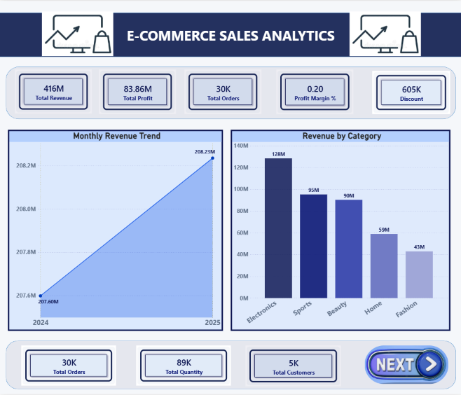
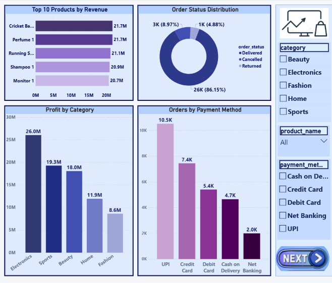
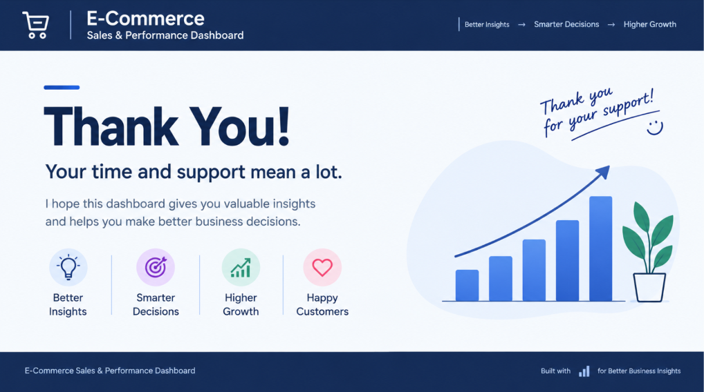

# 🛒 E-Commerce Sales & Performance Dashboard

<p align="center">
  
  
  
  
</p>

<p align="center">
  <strong>An interactive Power BI dashboard built to transform e-commerce data into clear, actionable business insights.</strong>
</p>

<p align="center">
  <a href="https://github.com/Rehan947">GitHub</a> •
  <a href="https://www.linkedin.com/in/rehan-pathan-">LinkedIn</a> •
  <a href="https://rehan-rk.netlify.app/">Portfolio</a> •
  <a href="https://www.instagram.com/iampathan.0">Instagram</a>
</p>

---

## 📌 Project Overview

The **E-Commerce Sales & Performance Dashboard** is an interactive Business Intelligence project developed in **Microsoft Power BI**.

The goal is to provide a professional view of e-commerce performance across **revenue, profit, orders, customers, products, categories, payment methods, and order status**.

The project combines **data modeling, DAX measures, KPI design, interactive filters, and business-focused data visualization** into one analytical solution.

> **Raw Data → Data Model → DAX → Visualization → Business Insights**

---

## 🎯 Business Objectives

This dashboard was designed to answer questions such as:

- 💰 How much revenue and profit are being generated?
- 📈 How does revenue change over time?
- 🛍️ Which product categories generate the most revenue?
- 🏆 Which products contribute the most revenue?
- 👥 How many customers are placing orders?
- 📦 How many orders and units are being sold?
- 💳 Which payment methods are used most frequently?
- 🚚 What is the distribution of order statuses?
- 📊 How does profitability vary across categories?

---

## 📊 Dashboard Preview

### 🏠 Executive Overview

<p align="center">
  
</p>

**Key areas:** Total Revenue, Total Profit, Total Orders, Total Customers, Total Quantity, Profit Margin, Monthly Revenue Trend, and Revenue by Category.

### 📦 Product & Sales Analysis

<p align="center">
  
</p>

**Key areas:** Top 10 Products by Revenue, Profit by Category, Order Status Distribution, Orders by Payment Method, and interactive filters.

### 🙌 Thank You

<p align="center">
  
</p>

---

## 🔑 Key Performance Indicators

| KPI | Description |
|---|---|
| 💰 **Total Revenue** | Total sales value generated from order items |
| 📈 **Total Profit** | Total profit generated across order items |
| 🧾 **Total Orders** | Number of unique orders |
| 👥 **Total Customers** | Number of unique customers |
| 📦 **Total Quantity** | Total quantity of products sold |
| 🎯 **Profit Margin %** | Profit as a percentage of revenue |

---

## 🧮 DAX Measures

### Total Revenue
```DAX
Total Revenue =
SUMX(
    Order_Items,
    Order_Items[quantity] * RELATED(Products[price])
)
```

### Total Profit
```DAX
Total Profit =
SUM(Order_Items[profit])
```

### Total Orders
```DAX
Total Orders =
DISTINCTCOUNT(Orders[order_id])
```

### Total Customers
```DAX
Total Customers =
DISTINCTCOUNT(Customers[customer_id])
```

### Total Quantity
```DAX
Total Quantity =
SUM(Order_Items[quantity])
```

### Profit Margin %
```DAX
Profit Margin % =
DIVIDE(
    [Total Profit],
    [Total Revenue],
    0
)
```

---

## 🗂️ Data Model

The Power BI model contains four main tables:

```text
Customers
    │
    │ 1 : *
    ▼
Orders
    │
    │ 1 : *
    ▼
Order_Items
    ▲
    │ * : 1
    │
Products
```

### Tables

| Table | Purpose |
|---|---|
| 👤 **Customers** | Customer information |
| 🧾 **Orders** | Order date, status, payment method and order-level information |
| 📦 **Order_Items** | Product quantities and profit at order-item level |
| 🛍️ **Products** | Product details, category and price |

### Relationships

- `Customers[customer_id]` → `Orders[customer_id]`
- `Orders[order_id]` → `Order_Items[order_id]`
- `Products[product_id]` → `Order_Items[product_id]`

---

## 🎨 Dashboard Design

The dashboard follows a clean, corporate Business Intelligence design system.

- 🎨 Light analytics canvas
- 🔵 Navy and blue primary palette
- ⚪ Clean white KPI cards
- 📐 Consistent spacing and alignment
- 📊 Minimal chart styling
- 🔎 Interactive slicers
- 🧭 Clear visual hierarchy
- 💼 Business-focused presentation

### Color Palette

| Purpose | Hex |
|---|---|
| Primary Blue | `#2563EB` |
| Dark Navy | `#172554` |
| Accent Cyan | `#06B6D4` |
| Positive / Profit | `#16A34A` |
| Negative / Cancelled | `#DC2626` |
| Background | `#F5F7FA` |
| Card Background | `#FFFFFF` |
| Main Text | `#111827` |
| Secondary Text | `#64748B` |

---

## 🛠️ Tools & Technologies

<p align="center">
  
  
  
  
  
</p>

**Skills demonstrated:** Power BI • DAX • Data Modeling • Data Visualization • KPI Development • Business Intelligence • Dashboard Design • Analytical Storytelling

---

## 📁 Repository Structure

```text
ecommerce-powerbi-dashboard/
│
├── 📄 README.md
├── 📊 E-Commerce_Sales_Dashboard.pbix
├── 📗 ecommerce_dataset.xlsx
│
└── 📁 screenshots/
    ├── 🖼️ page1-overview.png
    ├── 🖼️ page2-product-analysis.png
    └── 🖼️ thank-you.png
```

---

## 🚀 How to Use

### 1. Clone the repository
```bash
git clone https://github.com/Rehan947/ecommerce-powerbi-dashboard.git
```

### 2. Open the project

Open `E-Commerce_Sales_Dashboard.pbix` using **Microsoft Power BI Desktop**.

### 3. Explore

Use the dashboard slicers and visuals to analyze Revenue, Profit, Orders, Customers, Products, Categories, Payment Methods, Order Status, and time-based performance.

---

## 💡 What I Learned

This project strengthened my practical understanding of:

- Building relational data models in Power BI
- Creating DAX measures
- Designing KPI cards
- Creating interactive charts
- Applying slicers and filters
- Building a consistent dashboard theme
- Selecting visuals based on business questions
- Presenting data through a professional BI layout
- Turning raw e-commerce data into an analytical story

---

## 🔮 Future Improvements

- 📅 Year-over-Year growth analysis
- 📈 Month-over-Month growth %
- 🎯 Sales target vs actual performance
- 🧑‍🤝‍🧑 Customer segmentation
- 🔁 Repeat customer analysis
- 💸 Discount impact analysis
- 🗺️ Geographic sales analysis
- 📦 Product contribution analysis
- ⚡ Advanced time-intelligence DAX
- 📊 Drill-through pages
- 🔖 Advanced tooltips and bookmark navigation

---

## ⚠️ Data Note

This project is created for **learning, portfolio, and demonstration purposes**.

The dataset represents a **generic e-commerce business scenario** and is not presented as data from any specific marketplace or company.

If the dataset is redistributed, verify and follow its original source/license terms.

---

## 👨‍💻 About Me

Hi, I'm **Rehan Pathan** — a **BCA student, Data Analyst, Frontend Developer, and aspiring Data Scientist**.

I enjoy working with data, building dashboards, developing web experiences, and continuously improving my technical skills.

**Current focus:** Data Analytics • Power BI • DAX • SQL • Python • Data Visualization • Data Science

---

## 🌐 Connect With Me

<p align="center">
  <a href="https://github.com/Rehan947">
    
  </a>
  <a href="https://www.linkedin.com/in/rehan-pathan-">
    
  </a>
  <a href="https://rehan-rk.netlify.app/">
    
  </a>
  <a href="https://www.instagram.com/iampathan.0">
    
  </a>
</p>

---

## ⭐ If You Like This Project

If you found this project useful:

- ⭐ Star the repository
- 👀 Explore the dashboard
- 💬 Share feedback
- 🤝 Connect with me

---

<p align="center">
  <strong>Turning Data into Insights. Building Skills into Solutions. 🚀</strong>
</p>

<p align="center">
  Made with Power BI • DAX • Data Visualization • Curiosity
</p>
